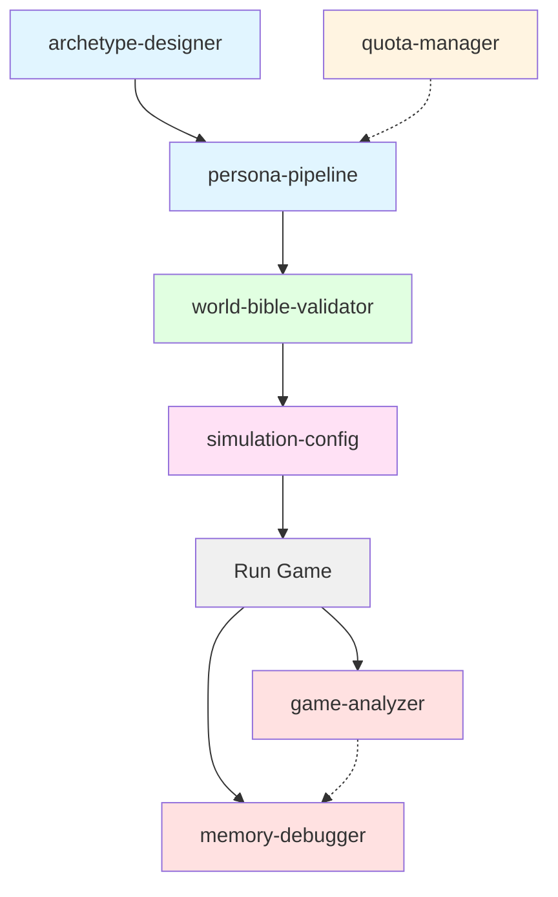

# TraitorSim Orchestrator

Coordinate complete TraitorSim workflows by combining multiple specialized skills. This orchestrator guides you through persona generation, game configuration, execution, and post-game analysis.

## Quick Start

**Complete end-to-end workflow:**
```bash
# 1. Generate persona library (one-time setup)
/persona-pipeline --count 50

# 2. Configure simulation
/simulation-config --rule-set UK --players 22

# 3. Run game
python -m src.traitorsim

# 4. Analyze results
/game-analyzer --game-log data/logs/latest.json
```

## Available Workflows

### Workflow 1: Persona Library Creation (One-Time Setup)

**Goal:** Generate a reusable library of 50-100 personas

**Skills used:**
1. `archetype-designer` - Design or review archetypes
2. `quota-manager` - Plan API quota usage
3. `persona-pipeline` - Generate personas via Deep Research + Claude
4. `world-bible-validator` - Validate lore consistency

**Steps:**

```bash
# Step 1: Review archetype definitions
/archetype-designer
# Inspect 13 archetypes, adjust OCEAN ranges if needed

# Step 2: Plan quota usage
/quota-manager
# For 50 personas: ~$20-25, ~6-8 hours with quota limits
# Decide on wave strategy (6→4→2→2 pattern)

# Step 3: Generate persona library
/persona-pipeline --count 50
# Runs 5-stage pipeline:
#   - Generate skeletons
#   - Submit Deep Research jobs (in waves)
#   - Poll until complete
#   - Synthesize backstories with Claude Opus
#   - Validate all personas

# Step 4: Validate World Bible compliance
/world-bible-validator --library data/personas/library/production_50_personas.json
# Check for forbidden brand leakage
# Verify in-universe brand usage

# Output: data/personas/library/production_50_personas.json
```

**Timeline:**
- Archetype review: 30 min
- Skeleton generation: 5 min
- Deep Research submission + polling: 2-4 hours (quota-limited)
- Synthesis: 15-30 min
- Validation: 5 min
- **Total: ~3-5 hours active work, 6-8 hours elapsed**

**Cost:** ~$20-25 for 50 personas (~$0.40-0.50 each)

### Workflow 2: Run Single Simulation

**Goal:** Run one game with existing persona library

**Skills used:**
1. `simulation-config` - Set game rules and parameters
2. (Run game via main script)
3. `memory-debugger` - Inspect agent behaviors if issues
4. `game-analyzer` - Analyze outcomes and patterns

**Steps:**

```bash
# Step 1: Configure simulation
/simulation-config
# Choose: UK/US/Australia rules
# Set player count, Traitor count, recruitment type

# Example: Standard UK game
python -c "
from src.traitorsim.core.config import SimulationConfig
config = SimulationConfig(
    rule_set='UK',
    num_players=22,
    num_traitors=4,
    persona_library_path='data/personas/library/production_50_personas.json'
)
config.save('configs/uk_standard.json')
"

# Step 2: Run simulation
python -m src.traitorsim --config configs/uk_standard.json

# Step 3: If issues arise, debug agent memory
/memory-debugger --player player_03
# Inspect profile.md, trust matrix, diary entries

# Step 4: Analyze game results
/game-analyzer --game-log data/logs/game_2025_12_21.json
# Trust matrix evolution
# Voting patterns
# Mission performance
# Emergent behaviors

# Output: Game log, analysis report
```

**Timeline:** 10-30 minutes per game (depends on agent count)

**Cost:** ~$2-5 per game (GameMaster + agent API calls)

### Workflow 3: Batch Simulation for Research

**Goal:** Run 50+ games to analyze rule variants or archetype balance

**Skills used:**
1. `simulation-config` - Create multiple configurations
2. (Batch execution script)
3. `game-analyzer` - Aggregate analysis across games

**Steps:**

```bash
# Step 1: Create configurations
/simulation-config
# Generate 3 configs:
#   - UK standard
#   - UK with ultimatum recruitment
#   - UK with no recruitment

python -c "
from src.traitorsim.core.config import SimulationConfig

configs = [
    SimulationConfig(rule_set='UK', recruitment_type='standard'),
    SimulationConfig(rule_set='UK', recruitment_type='ultimatum'),
    SimulationConfig(rule_set='UK', recruitment_type='none')
]

for i, config in enumerate(configs):
    config.save(f'configs/experiment_{i}.json')
"

# Step 2: Run batch simulations
for i in {0..2}; do
    for trial in {1..50}; do
        python -m src.traitorsim --config configs/experiment_$i.json \
            --log-file data/logs/exp_${i}_trial_${trial}.json
    done
done

# Step 3: Aggregate analysis
/game-analyzer --batch
python scripts/aggregate_analysis.py \
    --input "data/logs/exp_*.json" \
    --output analysis/recruitment_experiment.md

# Analyze:
# - Traitor win rate by recruitment type
# - Average game length
# - Recruitment success rate
```

**Timeline:** 8-24 hours for 150 games (50 per config)

**Cost:** ~$300-750 for 150 games

### Workflow 4: Incremental Persona Expansion

**Goal:** Add more personas to existing library without regenerating all

**Skills used:**
1. `persona-pipeline` (incremental mode)
2. `quota-manager`
3. `world-bible-validator`

**Steps:**

```bash
# Step 1: Check existing library
cat data/personas/library/production_50_personas.json | jq 'length'
# Output: 50

# Step 2: Plan quota for expansion
/quota-manager
# Adding 25 personas: ~$10-12, ~3-4 hours

# Step 3: Generate new personas (incremental)
/persona-pipeline --count 25 --incremental
# Pipeline automatically:
#   - Loads existing library
#   - Generates only NEW skeletons (avoiding duplicates)
#   - Synthesizes only NEW personas
#   - Merges with existing library

# Step 4: Validate merged library
/world-bible-validator --library data/personas/library/production_75_personas.json

# Output: data/personas/library/production_75_personas.json (75 total)
```

**Timeline:** ~2-4 hours
**Cost:** ~$10-12 for 25 additional personas

### Workflow 5: Debug Poor Game Outcome

**Goal:** Understand why a game had unexpected results

**Skills used:**
1. `game-analyzer` - Identify what happened
2. `memory-debugger` - Inspect agent states
3. `simulation-config` - Check if config was correct

**Steps:**

```bash
# Symptom: Traitors won too easily

# Step 1: Analyze game log
/game-analyzer --game-log data/logs/poor_game.json

# Check:
# - Were Traitors too powerful? (too many Traitors initially)
# - Did Faithfuls update trust matrices?
# - Were voting patterns logical?

# Step 2: Debug agent memory
/memory-debugger

# For each Faithful who performed poorly:
cat data/memories/player_05/suspects.csv
# Check if trust matrix updated at all

cat data/memories/player_05/diary/day_03_roundtable.md
# Check if observations were detailed

# Step 3: Review configuration
/simulation-config
cat configs/current_config.json

# Check:
# - Was num_traitors too high?
# - Was tie_break_method favoring Traitors?
# - Were archetypes balanced?

# Step 4: Identify root cause
# Examples:
# - Traitors = 30% of players (too high, should be 15-20%)
# - Trust matrices not updating (bug in memory manager)
# - All Faithfuls had low Openness (didn't update beliefs)
```

### Workflow 6: New Archetype Development

**Goal:** Create and test a new archetype

**Skills used:**
1. `archetype-designer` - Define new archetype
2. `persona-pipeline` - Generate test personas
3. `simulation-config` - Run test games
4. `game-analyzer` - Validate archetype behavior

**Steps:**

```bash
# Step 1: Design new archetype
/archetype-designer

# Example: "The Paranoid Investigator"
python -c "
from src.traitorsim.core.archetypes import ArchetypeDefinition, ARCHETYPES

paranoid_investigator = ArchetypeDefinition(
    id='paranoid_investigator',
    name='The Paranoid Investigator',
    ocean_ranges={
        'openness': (0.65, 0.85),
        'conscientiousness': (0.70, 0.90),
        'extraversion': (0.35, 0.55),
        'agreeableness': (0.30, 0.50),
        'neuroticism': (0.75, 0.95)
    },
    # ... rest of archetype definition
)

ARCHETYPES['paranoid_investigator'] = paranoid_investigator
"

# Step 2: Generate test personas with new archetype
/persona-pipeline --archetype paranoid_investigator --count 3

# Step 3: Run test games with new archetype
/simulation-config
# Set up game with mix of archetypes including 2-3 paranoid investigators

python -m src.traitorsim --config configs/test_new_archetype.json

# Step 4: Analyze archetype behavior
/game-analyzer --focus-archetype paranoid_investigator

# Check:
# - Did high Neuroticism make them defensive?
# - Did high Conscientiousness improve trust tracking?
# - Did low Agreeableness lead to confrontations?
# - Was archetype balanced (not too powerful/weak)?
```

## Skill Coordination Reference

### When to Use Which Skill

**Starting a new TraitorSim project:**
→ Use **traitorsim-orchestrator** (this skill) → Follow Workflow 1

**Creating character archetypes:**
→ Use **archetype-designer**
- Define OCEAN trait ranges
- Set stat biases and demographics
- Design gameplay profiles

**Generating personas:**
→ Use **persona-pipeline**
- Run 5-stage pipeline (skeleton → research → synthesis → validation)
- Handle quota limits with wave submission
- Incremental generation for expansions

**Managing API quotas:**
→ Use **quota-manager**
- Client-side tracking
- Exponential backoff
- Wave-based submission strategies

**Validating lore consistency:**
→ Use **world-bible-validator**
- Detect forbidden brand leakage
- Ensure in-universe brand usage
- Batch validation reports

**Configuring simulations:**
→ Use **simulation-config**
- Set regional rules (UK/US/Australia)
- Configure player counts and recruitment mechanics
- Test rule variants

**Debugging agent behavior:**
→ Use **memory-debugger**
- Inspect profile.md, trust matrices, diary entries
- Validate memory updates
- Check skill files

**Analyzing game outcomes:**
→ Use **game-analyzer**
- Trust matrix evolution
- Voting pattern analysis
- Emergent behavior detection
- Personality-behavior correlation

### Skill Dependencies



**Legend:**
- Blue: Persona creation pipeline
- Yellow: Support/optimization
- Green: Validation
- Pink: Game configuration
- Gray: Game execution
- Red: Debugging/analysis

## Common Orchestrated Workflows

### Full Production Setup (First Time)

```bash
# 1. Review/customize archetypes
/archetype-designer
# Review 13 default archetypes, create custom ones if needed

# 2. Generate production persona library
/persona-pipeline --count 100
# ~$40-50, 10-15 hours with quota limits

# 3. Validate library
/world-bible-validator --library data/personas/library/production_100_personas.json

# 4. Create default configs
/simulation-config
# Generate configs for UK, US, Australia variants

# 5. Run test games
for ruleset in UK US Australia; do
    python -m src.traitorsim --config configs/${ruleset}_standard.json
done

# 6. Analyze test games
/game-analyzer --batch data/logs/test_*.json

# 7. Adjust configs based on results
# If needed, regenerate specific archetypes or configs

# Production ready!
```

### Daily Development Iteration

```bash
# 1. Make code changes to agent logic

# 2. Run quick test with small game
/simulation-config --players 10 --traitors 2
python -m src.traitorsim --config configs/dev_test.json

# 3. Debug if issues
/memory-debugger --player player_03
/game-analyzer --game-log data/logs/latest.json

# 4. Fix issues, repeat
```

### Weekly Research Experiment

```bash
# Monday: Design experiment
/simulation-config
# Create 3-5 configs varying one parameter

# Tuesday-Thursday: Run batch simulations
# 50 games per config = 150-250 total games
# Automated batch script

# Friday: Analysis
/game-analyzer --batch
# Aggregate statistics
# Generate research report

# Present findings!
```

## Troubleshooting Workflows

### Problem: Personas have brand leakage

**Workflow:**
1. `/world-bible-validator` - Identify leaked brands
2. Update synthesis prompt in `scripts/synthesize_backstories.py`
3. `/persona-pipeline --regenerate` - Regenerate affected personas
4. `/world-bible-validator` - Re-check

### Problem: Agents not updating trust matrices

**Workflow:**
1. `/game-analyzer` - Confirm trust matrices are static
2. `/memory-debugger` - Check if suspects.csv is being written
3. Review `src/traitorsim/memory/memory_manager.py`
4. Fix memory update logic
5. Re-run test game
6. `/game-analyzer` - Verify trust updates now occur

### Problem: Traitors winning too often

**Workflow:**
1. `/game-analyzer --batch` - Calculate Traitor win rate across games
2. `/simulation-config` - Check Traitor % (should be 15-20%)
3. Adjust `num_traitors` or `recruitment_type`
4. Run 20 test games with new config
5. `/game-analyzer --batch` - Re-calculate win rate
6. Iterate until balanced (~40-60% Traitor win rate)

### Problem: Quota errors during persona generation

**Workflow:**
1. `/quota-manager` - Review quota strategies
2. Update `scripts/batch_deep_research.py` with wave submission
3. Implement client-side QuotaTracker
4. `/persona-pipeline --resume` - Resume from last successful job
5. Monitor quota usage with logging

## Best Practices

### For Persona Generation Projects

1. **Start small, scale up:**
   - Generate 10-15 test personas first
   - Validate quality and cost
   - Then scale to 50-100 production personas

2. **Use incremental generation:**
   - Don't regenerate entire library for additions
   - Use `--incremental` flag to merge new personas

3. **Monitor quotas closely:**
   - Use QuotaTracker for large batches
   - Submit in waves (6→4→2→2 pattern)
   - Budget 1 hour per 3-5 personas for Deep Research

4. **Validate early and often:**
   - Run validation after each synthesis batch
   - Catch brand leakage immediately
   - Fix prompts before generating more

### For Game Execution Projects

1. **Test with small games first:**
   - 10-12 players for quick iteration
   - Identify bugs faster

2. **Use consistent configs:**
   - Save configs to JSON files
   - Version control them
   - Reproduce issues with same config

3. **Log everything:**
   - Enable detailed game logs
   - Save agent memory states at each phase
   - Makes post-game debugging easier

4. **Analyze failures immediately:**
   - Don't batch 100 games before analyzing
   - Check first 5-10 games
   - Iterate on configs

## When to Use This Skill

Use this skill when:
- Starting a new TraitorSim project from scratch
- Running complete end-to-end workflows
- Coordinating multiple specialized skills
- Troubleshooting complex issues spanning multiple components
- Planning multi-day research experiments
- Onboarding new team members to TraitorSim workflows

## When NOT to Use This Skill

Don't use this skill for:
- Single-skill tasks (use the specific skill directly)
- Quick one-off queries about specific components
- Simple debugging of isolated issues

Instead, use the specialized skills directly for focused tasks.
